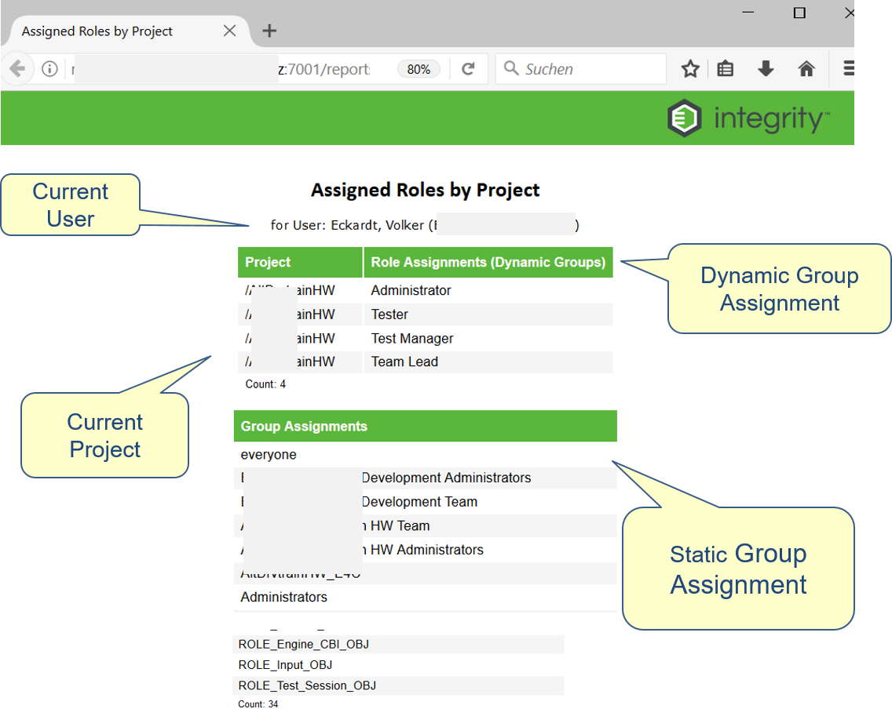

# Report "Assigned Roles by Project"
This reports lists all Dynamic and Static Groups for the current user and the selected item

# Use Case
The following Use Cases are covered
- As a User I want to see to which Roles and Groups I am assigned to, respecting the current project that I have selected.
- As an Administrator I want to review to which Roles and Groups a specific user is assigned to 

# Report Layout


# How to Install
Perform the following steps to install this report:
- copy the vbs Script into your local IntegrityClient/bin directory
- create a custom menu according to the following definition

```
Name:        Assigned Roles by Project
Program:     wscript
Parameters:  runReport.vbs  "Assigned Roles by Project"
Description: Opens a Report to show the Assigned Roles by Project for the current user
```
- copy the server files into the corresponding directories
-- 
- create a report with the name "Assigned Roles by Project" and select the matching rpt file
-- Select the "Item Based Report Selection" as Query 

## How To Test
- Select any item or open any item of your choice
- Start the report by choosing (M) Custom > Assigned Roles by Project

## Programming Language
- Integrity Report
- Integrity Beans
- JSP with embedded Java

## Programming Environment 
You need the following editor to develop this solution:
- Any Text Editor  (I am using always NetBeans :)

## Notes 
This is my first report where I am using Integrity Beans to create an administrative report. The interesting thing is that this just works (almost). The beauty is that the performance is amazingly fast, because the Beans are already loaded into the memory (I am talking about the Beans that are usually only used by triggers).

Unfortunately, I had to add another local VBS script to catch the current user, haven't found a better way to do this: A report don't know which user has executed it ;( 

## Open Issues
The following issues are known:
- The Group Lists are not sorted yet
- A normal user can change the parameters, and can view any users details (this might be solved by using https)
- In Firefox and Chrome the layout looks perfect, in IE it looks a bit "different" 
